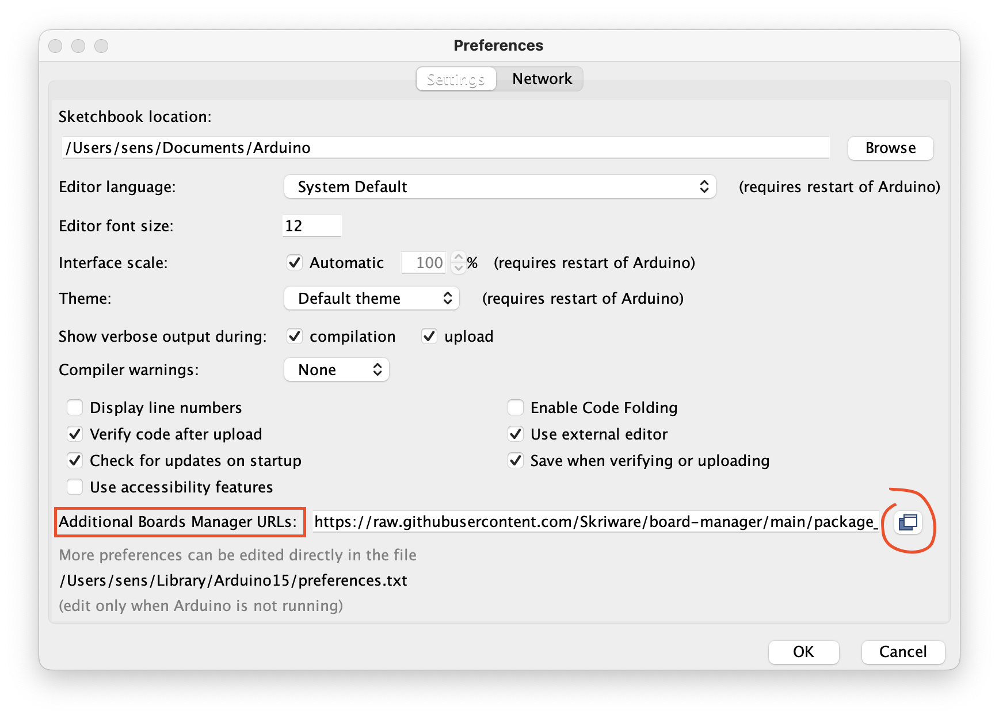
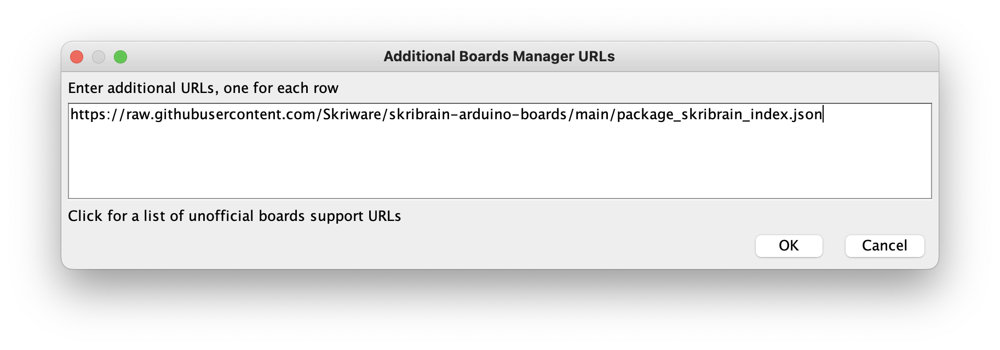
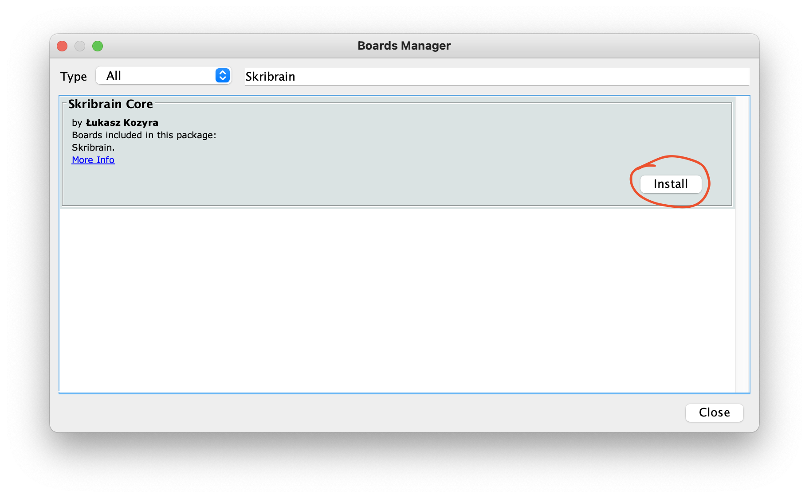

# Skribrain Core Board Manager

This is a repository containing additional Skribrain board definition for use
with Arduino IDE.

## Instructions

Open Arduino IDE and open the preferences. Find `Additional Boards Manager URLs`
and click the button on the right side of the screen.



Then, copy the following string and paste it as a new line in the newly opened
window and click `OK`:

```
https://raw.githubusercontent.com/Skriware/skribrain-arduino-boards/main/package_skribrain_index.json
```



Now go to `Tools -> Board -> Boards Manager...` and type `Skribrain` into the
search bar and click the `Install` button:


